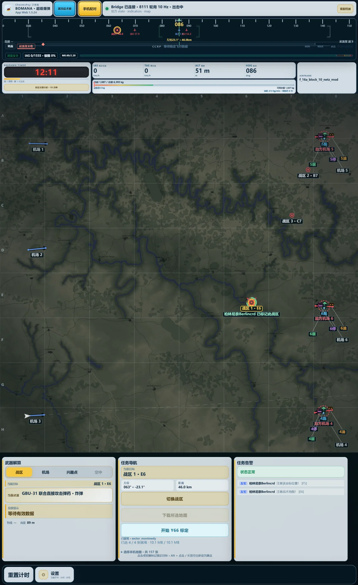
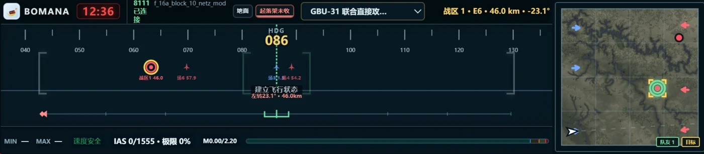

<div align="center">


# Bomana

War Thunder 全真飞行辅助：出击计时、战区与机场导航、空速安全、燃油与降落提示，以及可选的置顶导航窗。

[](https://bomana.ruikang.wang/launcher/)
[](https://bomana.ruikang.wang/launcher/)
[](https://bomana.ruikang.wang/launcher/)
[](docs/ARCHITECTURE.md)
[](LICENSE)

[打开 Bomana](https://bomana.ruikang.wang/) · [在线启动器与下载](https://bomana.ruikang.wang/launcher/) · [飞行工具箱](https://bomana.ruikang.wang/calculator/)

</div>

Bomana 把全真对局中需要反复查看的计时、方向、战区、机场和飞行状态集中到一个网页驾驶舱里。它通过本机 Bridge 读取 War Thunder 官方 ExtUI 数据，网页负责展示和计算；Bridge 只读固定的本机接口，不读取游戏进程内存、不注入、不修改游戏文件，也不自动操作游戏。

> Bomana 是第三方工具，不代表 Gaijin。8111 只能提供游戏公开给本机的观测，缺少数据时页面会隐藏或降低可信度；燃油、降落和武器相关数值属于辅助参考，不保证命中、摧毁或安全着舰。请按 War Thunder 当前规则自行判断是否使用。

## 版本怎么选

| 版本 | 适合谁 | 主要内容 | 来源与获取 |
| --- | --- | --- | --- |
| **Lite** | 只需要计时 | 出击 / 复活周期、进度、提示音和手动重置 | 本仓库公开源码，在线 Launcher 直接进入 |
| **Standard** | 想要稳定的基础导航 | Lite 全部功能；官方战区与机场导航、航向带、空速限速、燃油剩余时间、基础降落提示、检查单、置顶导航窗和局域网手机配对 | 本仓库公开源码，在线 Launcher 直接进入 |
| **Enhanced** | 需要更完整的战术辅助 | Standard 全部功能；战术地图、战区范围参考、POI / Y66 目标辅助、机场模块提示、地形辅助、CCRP 与其他武器投放参考、增强降落信息 | 单独提供的授权版本，按 Launcher 页面说明获取；实现不在本仓库 |

Enhanced 的战区、机场和投放窗口会结合当前可用的地图与飞行信息给出参考。服务器状态、地形遮挡、挂载识别或游戏内部判定无法由 8111 完整观测时，界面会保留不确定性提示，不把估算包装成确定结果。

## 真实界面

<div align="center">



<br>



</div>

电脑网页、置顶导航窗和手机页面共享同一个 Bridge 的官方 8111 数据来源，各端按自身界面维护计时和展示状态。置顶窗使用浏览器的 Document Picture-in-Picture 能力；浏览器被系统冻结时可能暂停，恢复后会重新连接并恢复有限的出击状态。

## 三步开始

1. 打开[在线启动器](https://bomana.ruikang.wang/launcher/)，下载并运行 `BomanaBridge.exe`。看到系统托盘中的 Bomana 图标后，回到 Launcher 点击连接。
2. 启动 War Thunder，并确认游戏正在提供官方 ExtUI 数据。Bomana 会按固定顺序检查本机 8111、9222 和 10333，用户不需要手动填写上游地址。
3. 选择 Lite 或 Standard，然后打开 App。Standard 手机配对在电脑上生成二维码，用同一局域网的手机浏览器打开即可，无需账号；Enhanced 是否需要授权以 Launcher 页面显示为准。

Bridge 下载页会展示版本、SHA-256 和来源证明。Launcher 只负责发现、提示和打开固定入口，不会静默执行下载的程序；更新 Bridge 时请由用户手动运行下载的文件。

## 公开仓库包含什么

这个仓库是 Bomana 的公开源码发行树，当前公开范围包括：

- Lite / Standard Web、共享运行时、公开参数和 Launcher；
- 只读官方 8111 Bridge、局域网手机配对和本地资源管理；
- 基础导航、空速与燃油参考、降落提示、置顶导航窗所需的测试与文档；
- 在线计算器的公开数据接口和基础工具。

Enhanced 的解算、地形数据与高级目标功能只在用户界面层面进行说明，相关实现、专用数据和授权资源不属于本仓库。公开 `main` 是经过检查后生成的源码发行分支；新贡献会先纳入维护源，再按文件清单导出。请不要在公开树上建立第二套独立产品或发布流程，详见[贡献指南](docs/CONTRIBUTING.md)。

## 本地开发

需要 Node.js 22、pnpm 11.3.0、Go 1.25 和 PowerShell 7：

```pwsh
pnpm --dir frontend install --frozen-lockfile
pnpm --dir frontend check
go -C native/telemetry_gateway test ./...
go -C native/telemetry_gateway vet ./...
```

Web 构建输出在 `frontend/dist/Lite`、`frontend/dist/Standard` 和 `frontend/dist/launcher`。公开 CI 只检查源码和构建，不保存生产密钥、不部署生产服务器，也不发布 Enhanced 或正式安装包。当前线上下载请以[在线 Launcher](https://bomana.ruikang.wang/launcher/)为准。

Basic Desktop 是公开源码中可按需手动构建的极简 Windows 计时 / 基础导航程序；公开仓库不承诺提供预构建桌面下载。Enhanced Desktop 是独立的私有手动分发版本，不包含在这里，也不会由公开 CI 构建。

更多边界见[公开版本契约](docs/specs/public-editions.md)、[Bridge 说明](docs/specs/bridge.md)、[公开架构](docs/ARCHITECTURE.md)、[隐私说明](docs/PRIVACY.md)和 [MIT 许可证](LICENSE)。
